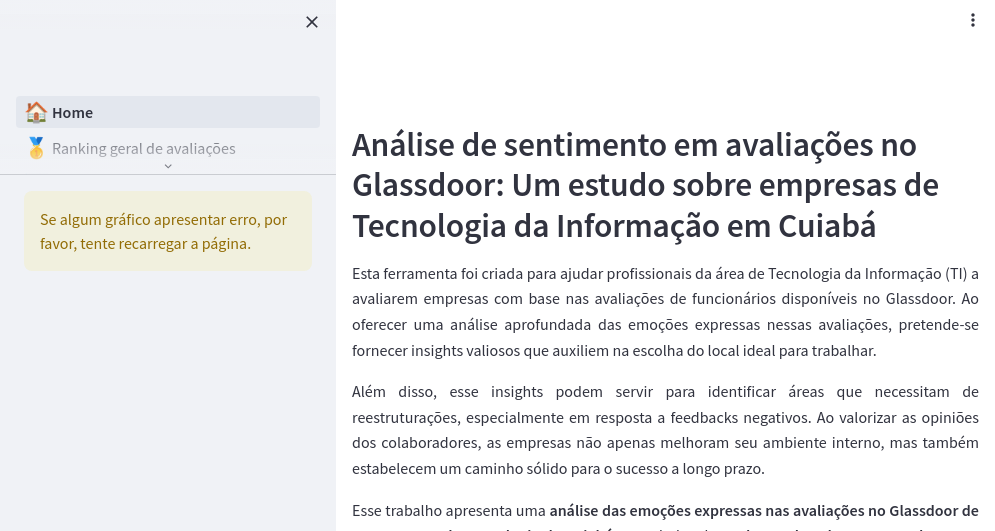

# Glassdoor Reviews Report

This repository contains a sentiment analysis report of Cuiabá IT Companies' reviews in Glassdoor. It also presents a model that leverages BERT-based architecture, specifically BERTimbau, to predict the sentiment of employee reviews.

The live preview can be found at: [Análise de sentimento em avaliações no Glassdoor: Um estudo sobre empresas de Tecnologia da Informação em Cuiabá](https://glassdoor-reviews-report.streamlit.app/).



⚠️ If you find the app in **sleep mode**, please hit the button **"Yes, get this app back up!"**.


## Application Overview

### [📊 Dashboard](./📊Dashboard.py)
The main entry point of the application that provides a comprehensive analysis of Glassdoor reviews for IT companies in Cuiabá. The dashboard includes:

#### 📊 Key Metrics
- Overall sentiment analysis metrics (positive, negative, neutral)
- Distribution of reviews by sentiment
- Analysis by employee role groups

#### 🏆 Company Rankings
- Positive reviews ranking
- Negative reviews ranking
- Detailed company analysis

#### 📊 Advanced Analysis
- Sentiment trends over time
- Rating distribution analysis
- Word cloud visualizations
- Most common words analysis
- N-gram analysis

## Detailed Pages

### [🏠 Análise Geral](./pages/1_🏠_Análise%20geral.py)
A comprehensive analysis of Glassdoor reviews for IT companies in Cuiabá, including:
- **Introduction**: Overview of the project goals and methodology using BERT-based sentiment analysis
- **Ranking Analysis**:
  - Top companies with highest positive reviews
  - Companies with most negative feedback
  - Detailed company performance metrics
- **Temporal Analysis**: Sentiment trends over time
- **Rating Analysis**: Correlation between star ratings and sentiment scores
- **Employee Role Analysis**: Sentiment distribution across different job functions
- **Text Analysis**:
  - Word clouds of most frequent terms
  - Top 10 most common words
  - N-gram analysis for common phrases
- **Conclusion**: Summary of key findings and insights

### [🥇 Ranking geral de avaliações](./pages/2_🥇_Ranking%20geral%20de%20avaliações.py)
Shows the number of reviews and the associated sentiment for each company, ordered by the difference between positive and negative reviews.

### [📉 Avaliações ao longo do tempo](./pages/3_📉_Avaliações%20ao%20longo%20do%20tempo.py)
Presents a sentiment analysis of reviews along the time by company.

### [⭐ Avaliações por quantidade de estrelas](./pages/4_⭐_Avaliações%20por%20quantidade%20de%20estrelas.py)
Examines how reviews correlate with star ratings for a chosen company.

### [🧑‍💼 Avaliações por grupo de funcionários](./pages/5_🧑‍💼_Avaliações%20por%20grupo%20de%20funcionários.py)
Shows reviews categorized by different employee groups for a specific company.

### [☁️ Nuvem de Palavras por empresa](./pages/6_☁️_Nuvem_de_Palavras_por_empresa.py)
Shows Word Cloud by company.

### [📊 Top 10 palavras mais usadas](./pages/7_📊_Top%2010%20palavras%20mais%20usadas.py)
Shows Top 10 frequent words by company.

### [🔠 NGrams](./pages/8_🔠_NGrams.py)
Shows N-Grams by company.

### [🧠 Treinamento do Modelo](./pages/9_🧠_Treinamento%20do%20Modelo.py)
Shows Data Preparation, Model Architecture, Model Training and Model Evaluation.

## How to Run the Application

### Prerequisites
- Python 3.11

1. Clone the repository:
    ```sh
    git clone https://github.com/yourusername/glassdoor-reviews-report.git
    cd glassdoor-reviews-report
    ```

2. Install the required dependencies:
    ```sh
    pip install -r requirements.txt
    ```

3. Run the Streamlit application:
    ```sh
    streamlit run 📊Dashboard.py
    ```

4. The application will start and automatically open in your default web browser. If it doesn't, you can access it at `http://localhost:8501`
